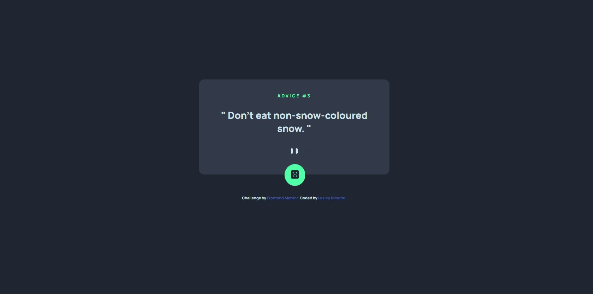
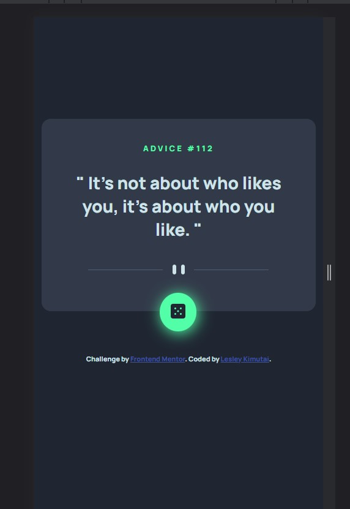
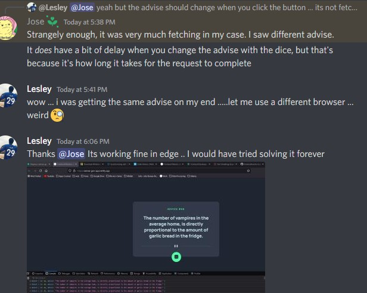

# Frontend Mentor - Advice generator app solution

This is a solution to the [Advice generator app challenge on Frontend Mentor](https://www.frontendmentor.io/challenges/advice-generator-app-QdUG-13db). Frontend Mentor challenges help you improve your coding skills by building realistic projects.

## Table of contents

- [Overview](#overview)
  - [The challenge](#the-challenge)
  - [Screenshot](#screenshot)
  - [Links](#links)
- [My process](#my-process)
  - [Built with](#built-with)
  - [What I learned](#what-i-learned)
  - [Continued development](#continued-development)
- [Author](#author)
- [Acknowledgments](#acknowledgments)

## Overview

### The challenge

Users should be able to:

- View the optimal layout for the app depending on their device's screen size
- See hover states for all interactive elements on the page
- Generate a new piece of advice by clicking the dice icon

### Screenshot

Laptop and Tablet View Modes


Mobile View of the Advice app


### Links

- Solution URL: [Github Link](https://github.com/issagoodlifeInc/advice-gen-app.git)
- Live Site URL: [Advice Generator](https://advise-gen-app.netlify.app/)

## My process

- Initialized git the required `react`, `react-dom`, `react-scripts` for the app
- Set up the public and src folders and their respective files/ folders
- Tweaked the `package.json` to be able to `build` and `start` the app using `react-scripts`

  ```js
  "scripts": {
  "start": "react-scripts start",
  "build": "react-scripts build",
  },
  "eslintConfig": {
  "extends": [
    "react-app",
    "react-app/jest"
  ]
  }
  <!-- Tweak eslint config to remove import error -->
  <!-- Setting CI=false removes build error where warnings are taken as an error -->

  ```

- Set up the `index.html,.js styles.css,App.js` and all Footer Component
- Worked on the `main` part of the advice gen the styled
- Required `axios` and used it to get random advices that were saved to state using `useState`
- Used `useEffect` to change the divider image according to the screen width
- Added a click function to the button to generate a new advice when clicked
- Deployed it then came here to write this up

-Get request not working well on Mozilla though

### Built with

- Semantic HTML5 markup
- CSS custom properties
- Flexbox
- CSS Grid
- Laptop-first workflow
- [React](https://reactjs.org/) - JS library
- [Axios](https://www.npmjs.com/package//axios) - Promise based HTTP client for the browser

### What I learned

Code I'm proud of + Things I learnt

- Ussing useEffect to change divider image and also get response from the advice url

```js
// Changing the divider image as per teh screen width dynamically
const [width, setWidth] = React.useState(window.innerWidth);

const [advice, setAdvice] = React.useState({});

const updateDimensions = () => {
  setWidth(window.innerWidth);
};
useEffect(() => {
  window.addEventListener("resize", updateDimensions);
  setAdvice(fetchData());
}, []);

= 580 ? divider : dividermobile} alt="dividerline" />;
```

- Getting data through axios

```js

 const fetchData = async () => {
    await axios.get(url).then((res) => {
      console.log(res.data.slip);
      setAdvice(res.data.slip);
      return res.data.slip;
    });
  };
// Function to fetch new data from url
  const getAdvice = () => {
    fetchData();
    console.log(advice);
  };
        <button onClick={getAdvice} className="btn--advice">

```

### Continued development

Learn more React usage and best practices

- Like using `useEffect` {The first time using it, invoked the `fetchData` function on the dependancy part creating a forever loop on one of my deploys before knowing what I hade done}
- Learn more on using useState in React

Better turnaround time

## Author

- Website - [Lesley Kimutai](https://leskimfamily.herokuapp.com/)
- Frontend Mentor - [@Leskim](https://www.frontendmentor.io/profile/Leskim)
- Twitter - [@KimutaiLesley](https://twitter.com/KimutaiLesley)

## Acknowledgments

@Jose From Scrimba Discord #react-help channel - Helped me know the onclick function was working fine just my Firefox that wasn't getting new advice

